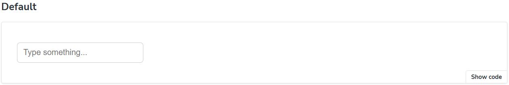
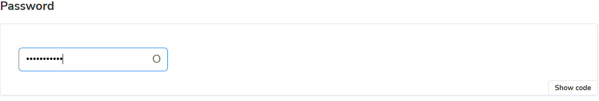
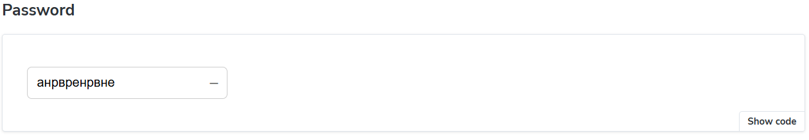
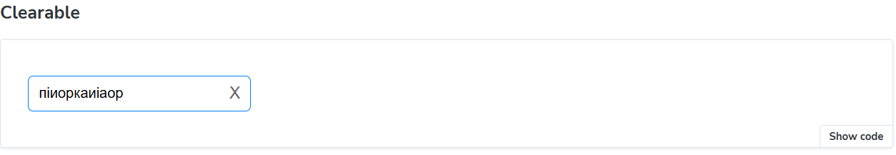
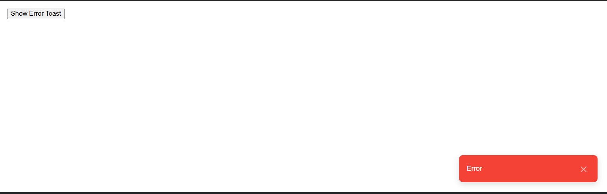
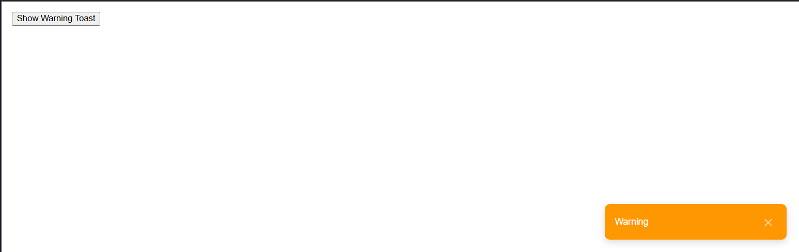
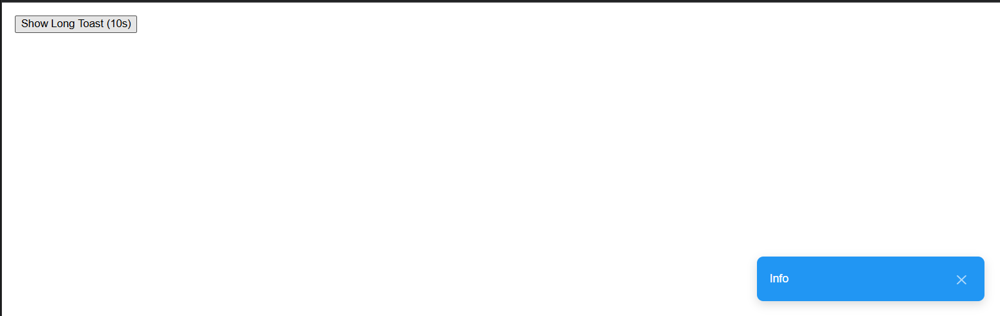
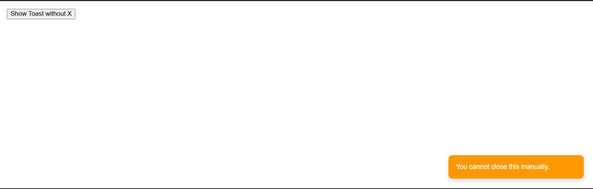
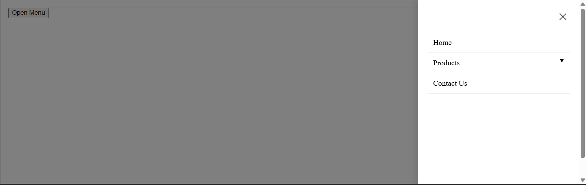
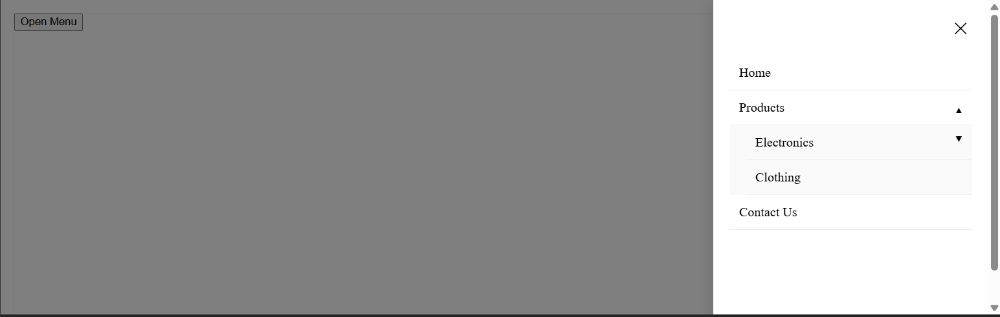

# React Component Library Assessment

A collection of reusable UI components built with React, TypeScript, and Storybook.

## Setup Instructions

Follow these steps to run the project locally:

1. **Clone the repository:**
   ```bash
   git clone https://github.com/NataliaHarashchuk/Storybook-Task.git
2. **Install dependencies:**
   ```bash
   npm install
3. Run Storybook:
   ```bash
   npm run storybook
   
## Component Overview

1. Input Component




2. Toast Component






3. Sidebar Menu Component


